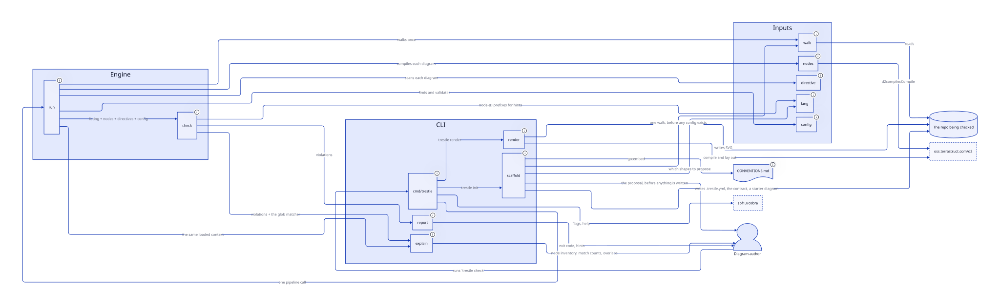

# Trestle

**Keeps architecture diagrams honest by binding diagram nodes to real paths in the repo, and
failing CI when they diverge.**

Architecture diagrams drift. Not because people are careless, but because nothing connects the
diagram to the thing it describes. A service gets renamed, a module gets deleted, a new subsystem
appears — and the diagram stays exactly as correct-looking as it was the day it was drawn.

Diagram-as-code fixes *reviewability*. It does not fix *truth*. A D2 file can be perfectly
version-controlled and completely wrong.

Trestle adds the missing edge: a declared, checkable binding between a node in the diagram and a
path in the codebase.

## Quick start

```console
go install github.com/timimsms/trestle/cmd/trestle@v0.1.0

cd your-repo
trestle init      # proposes discover: rules from your layout, writes a config and an empty diagram
trestle check     # every directory that needs an owning box, with the line to paste for each
```

`init` writes **no nodes** into the starter diagram, on purpose: a diagram generated from your own
directory listing cannot disagree with that listing, so it would pass its own check while telling
you nothing. The first `check` is your to-do list, and each violation carries the exact `@bind`
line that resolves it.

Go 1.25+, and nothing else — D2 is embedded, so there is no `d2` binary to install.

---

## Trestle, checking Trestle

Every box below is bound to a Go package in this repo, and `make self-check` runs in CI. The
`lang` node exists because adding that package failed the check until the diagram learned about
it — the tool has caught its own author four times now.

<p align="center">
  
</p>

<sub>Generated by <code>trestle render</code> through the embedded D2 library. Regenerate with
<code>make render && cp docs/architecture/rendered/system.svg docs/img/trestle-self.svg</code>.</sub>

---

## How it works

Bindings are magic comments inside the `.d2` file — no sidecar, because a sidecar bindings file
is itself a drift surface.

```d2
# @bind     svc_billing app/services/billing/**
# @bind     svc_billing app/jobs/billing/**
# @external ext_stripe
# @infra    db_primary
# @ignore   legacy_reporting "deleted Q3, kept for the migration narrative"

svc_billing: Billing Service
```

Then:

```console
$ trestle check

docs/architecture/system.d2

  ORPHAN    svc_billing
            @bind app/services/billing/** matches 0 files
            hint: renamed? `git log --diff-filter=D -- app/services/billing`

.trestle.yml

  UNMAPPED  app/services/notifications/
            no @bind glob covers this path
            hint: add `# @bind svc_notifications app/services/notifications/**` to a diagram, or add `app/services/notifications/**` to `shared:`

2 failures, 0 warnings
```

Findings group under the file responsible for them. A stale `@bind` is a fact about the diagram
that declared it; an unowned directory is a fact about the `discover:` rule that went unsatisfied,
and no single diagram is more to blame than another.

Exit `0` clean, `1` violations, `2` tool error. `1` and `2` stay distinct so CI can tell "your
diagram is wrong" from "Trestle is broken."

## Five violations, and only five

| Code | Fires when | Default |
| --- | --- | --- |
| `ORPHAN` | a `@bind` glob or `shared:` entry matches zero files | fail |
| `UNMAPPED` | a `discover:`-matched path is covered by no binding | fail |
| `DANGLING` | a directive names a node absent from the diagram | fail |
| `UNBOUND` | a node has no directive of any kind | warn |
| `SYNTAX` | malformed directive | fail |

Five is the number people will actually learn. New failure modes fold into existing codes.

## What a green check does *not* mean

Trestle ties **boxes to code**. It does not verify what the diagram says about those boxes, and
knowing the difference is the difference between trusting the exit code correctly and over-trusting
it.

| A green `trestle check` guarantees | It does not guarantee |
| --- | --- |
| Every node has code behind it | That the code does what the node claims |
| Code under a `discover:` rule has an owning node | That new architecture *inside* an already-bound directory is on the diagram |
| No binding points at a path that no longer exists | That a service still *is* a service — gut it but leave one file and the glob still matches |
| — | **That any edge on the diagram is true** |

That last row is the one that surprises people. Bindings are node→path, so the arrows — who calls
whom, which is most of what a system diagram communicates — are unverified prose. You can draw an
edge that never existed, or delete one that does, and the check stays green.

This is a deliberate boundary, not a gap to be filled. Verifying edges means call-graph analysis,
which is a different tool. What Trestle prevents is a narrower and still-common class of lie: a box
with nothing behind it, and code with no box. **A rename is the most frequent way a diagram goes
stale, and on that case the check is genuinely good** — it fails with the exact binding line to
paste.

Treat `trestle check` as a floor, not a proof.

## Commands

```
trestle check [--format=human|json] [--strict]   validate bindings — the product
trestle render [--watch]                         render via embedded D2
trestle explain [node_id] [--overlaps]           show what Trestle parsed
trestle init [--yes] [--dry-run]                 scaffold config + conventions
```

Four. Resist adding a fifth.

`render` writes an SVG per diagram to `render.out`, using the layout engine and theme from
`.trestle.yml`. **No `d2` binary is required** — D2 is embedded, so the renderer and the parser
cannot disagree about a version. `--watch` re-renders on save, debounced, and keeps going through
the syntax errors that exist between one keystroke and the next.

`explain` with no argument lists every node in every diagram with its binding status, the glob
behind it, and how many files that glob matches right now — the answer to "does the tool see what
I think it sees". With a node ID it shows that node's bindings, the files each one claims, and its
violations. `--overlaps` lists paths claimed by more than one node, which is legal and never a
failure. `--format=json` is the shape an agent should read before editing a diagram.

`init` sets a repo up: it seeds `discover:` rules from the layout it recognizes, writes
`CONVENTIONS.md` — embedded in the binary, so there is one copy of the contract — appends a
stanza to `AGENTS.md`, and scaffolds a starter diagram. It proposes rather than imposes: the
rules and the directories each one matches are printed first, and nothing is written until you
agree (`--yes` for scripts, `--dry-run` to look). Nothing existing is overwritten, ever.

**The starter diagram is empty, and the first `trestle check` fails.** That is the design. A
diagram generated from your directory listing would pass its own check — Trestle having written
both sides of the comparison — while telling you nothing, and edges cannot be guessed at all.
So the first run reports one `UNMAPPED` per discovered directory, each carrying the `@bind` line
that fixes it. It is an inventory, not a verdict, and working it down is how the first diagram
gets written.

## What Trestle is not

A diagram editor, a WYSIWYG surface, a rendering engine, a hosted product, a model/view system,
or a history layer. These are deliberate exclusions, not backlog items — see
[`OVERVIEW.md`](docs/planning/handoff/OVERVIEW.md) for why each one is out.

## Documentation

| File | Contains |
| --- | --- |
| [`CONVENTIONS.md`](CONVENTIONS.md) | The agent contract. Ships with the product. |
| [`CHANGELOG.md`](CHANGELOG.md) | What changed per release, and what changed *behaviour* |
| [`SECURITY.md`](SECURITY.md) | Scope, and how to report |
| [`CONTRIBUTING.md`](CONTRIBUTING.md) | Setup, the constraints and why they hold, where help is useful |
| [`docs/DOGFOODING.md`](docs/DOGFOODING.md) | How to run the trial that decides whether this ships |
| [`docs/planning/mvp/GAMEPLAN.md`](docs/planning/mvp/GAMEPLAN.md) | Build plan, gate verdicts, architecture |
| [`docs/planning/mvp/phases/`](docs/planning/mvp/phases/) | Per-phase tasks and acceptance criteria |
| [`docs/planning/handoff/OVERVIEW.md`](docs/planning/handoff/OVERVIEW.md) | Scope, non-goals, decision ledger L1–L12 |
| [`docs/planning/handoff/DESIGN.md`](docs/planning/handoff/DESIGN.md) | Binding syntax, check semantics, CLI surface |
| [`docs/planning/handoff/TECH_STACK.md`](docs/planning/handoff/TECH_STACK.md) | Language, dependencies, layout, testing |
| [`examples/repairs-platform/`](examples/repairs-platform/) | Worked example — a live test input |

## Development

```console
make             # fmt, vet, test, build
make self-check  # Trestle checks Trestle, --strict
make test-core   # internal/check alone — it must stay I/O-free
make bench       # the 200ms/100k-file target
make spike REPO=~/code/foo DEPTH=2   # re-run the Spike 01 drift probe (read-only)
```

Go 1.25+, and nothing else — D2 is embedded as a library, so there is no `d2` binary to install.

## License

[MIT](LICENSE).

## Success criterion

> `trestle check` fails on a real PR, at least once in the first month, for a reason that was not
> anticipated when the bindings were written.

If it never fires, it is decoration and should be deleted. This is deliberately falsifiable, and
it is the evaluation gate rather than a slogan — which is why
[`docs/DOGFOODING.md`](docs/DOGFOODING.md) exists and why a dogfood report where nothing fired is
still worth filing.

**Where it stands.** The check has fired on real drift several times, but almost always for
*anticipated* reasons — a rename produces `ORPHAN`, a new directory produces `UNMAPPED`. Those are
the flagship cases, and catching them is the tool doing its advertised job rather than surprising
anyone.

It has surprised us exactly once. The first run against a repo that was not a fixture found a node
that **does not exist in the source**: a `;` inside a D2 tooltip is a statement separator, so the
compiler had silently turned trailing prose into a child node. The diagram rendered fine and no
reviewer would have caught it. The only reason anyone found out is that Trestle asked what code
backed it.

One catch, on the tool's own repo, is not a track record. It is now running as a gate on a repo
where work is actually happening, which is the test that matters.
